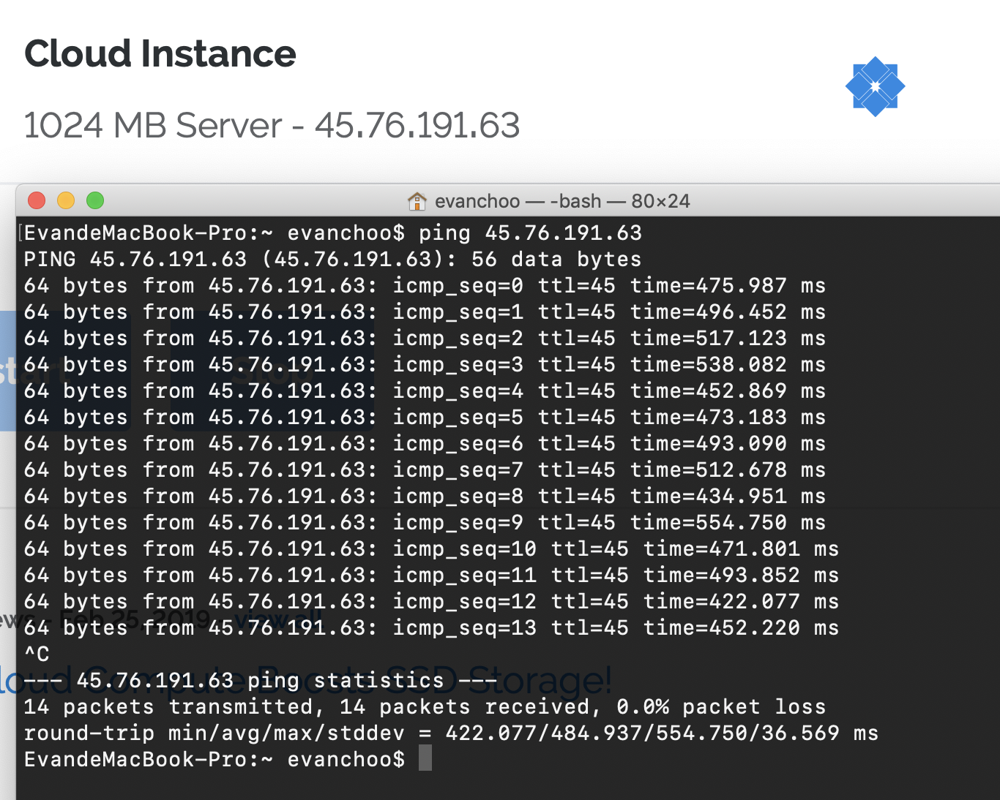
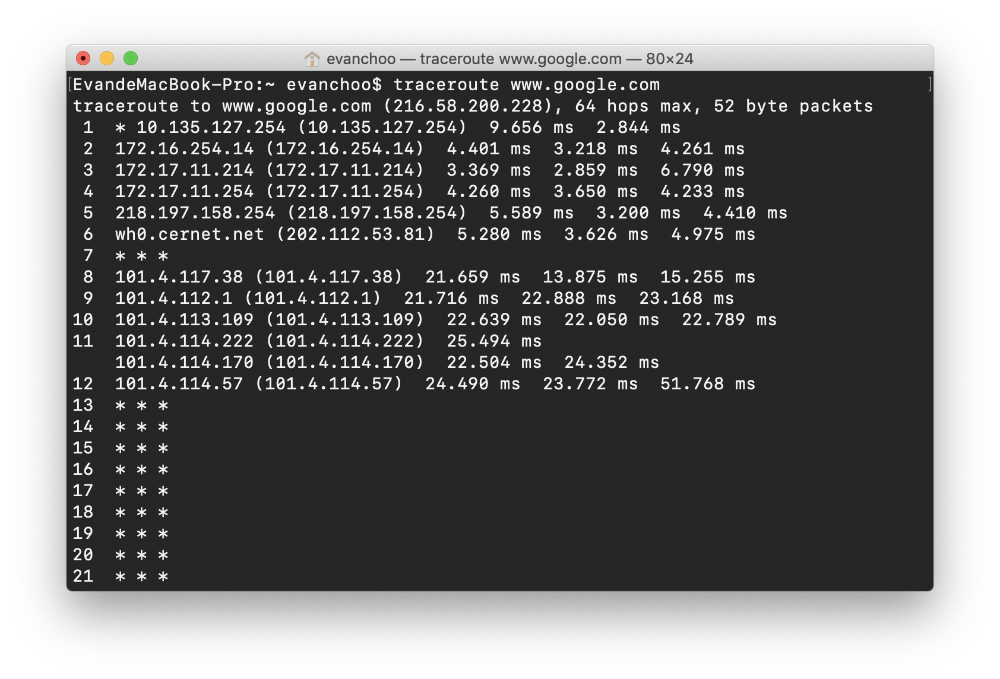

## Chapter 1

**Ping**

**Traceroute**

**P5** Review the car-caravan analogy in Section 1.4. Assume a propagation speed of 100 km/hour. 

1. Suppose the caravan travels 150km, beginning in front of one tollbooth, passing through a second tollbooth, and finishing just after a third toll- booth. What is the end-to-end delay? 
2. Repeat(a), now assuming that there are eight cars in the caravan instead of ten. 

**Solution**:

1. 10 * 12s * 3 + 75km / 100km/h * 2 = 96 mins
2. 8 * 12s *3 + 75km / 100km/h * 2 = 94.8 mins

**P8** Suppose users share a 3 Mbps link. Also suppose each user requires 150 kbps when transmitting, but each user transmits only 10 percent of the time. (See the discussion of packet switching versus circuit switching in Section 1.3.) 

1. When circuit switching is used, how many users can be supported? 
2. For the remainder of this problem, suppose packet switching is used. Find the probability that a given user is transmitting. 
3. Suppose there are 120 users. Find the probability that at any given time, exactly n users are transmitting simultaneously. (Hint: Use the binomial distribution.) 
4. Find the probability that there are 21 or more users transmitting simultaneously. 

**Solution**:

1. 3 Mbps / 150 kbps = 20

   So 20 users can be supported.

2. According to the text, a given user is transmitting has probability 10%.

3. The probability can be expressed as the following:

   $$
   P(x = n) = C^{n}_{120}*0.1^{n}*(1-0.1)^{120-n} = C^{n}_{120}*0.1^{n}*0.9^{120-n}
   $$

4. The probability is calculated as follows:
   $$
   P(x >= 21)=1-P(x<=20)= 1-P(\frac{\sum^{120}_{k=0}X_k-np}{\sqrt{np(1-p)}}<=\frac{20-np}{\sqrt{np(1-p)}})=0.007
   $$

**P10** Consider a packet of length L which begins at end system A and travels over three links to a destination end system. These three links are connected by two packet switches. Let di, si, and Ri denote the length, propagation speed, and the transmission rate of link i, for i = 1, 2, 3. The packet switch delays each packet by dproc. Assuming no queuing delays, in terms of di, si, Ri, (i = 1,2,3), and L, what is the total end-to-end delay for the packet? Suppose now the packet is 1,500 bytes, the propagation speed on all three links is 2.5 · 108 m/s, the transmission rates of all three links are 2 Mbps, the packet switch processing delay is 3 msec, the length of the first link is 5,000 km, the length of the second link is 4,000 km, and the length of the last link is 1,000 km. For these values, what is the end-to-end delay?

**Solution**:
$$
d_{overrall} = d_{proc}*2+(\frac{L}{R_1}+\frac{L}{R_2}+\frac{L}{R_3})+(\frac{d_1}{s_1}+\frac{d_2}{s_2}+\frac{d_3}{s_3})\\
L = 1500 bytes = 12,000bits\\
d_{overrall} = 3ms*2+\frac{12000}{2000}ms*3+(\frac{5000*10^3}{2.5*10^8}+\frac{4000*10^3}{2.5*10^8}+\frac{1000*10^3}{2.5*10^8})*10^3ms=64ms
$$
Thus the end-to-end delay is 64ms