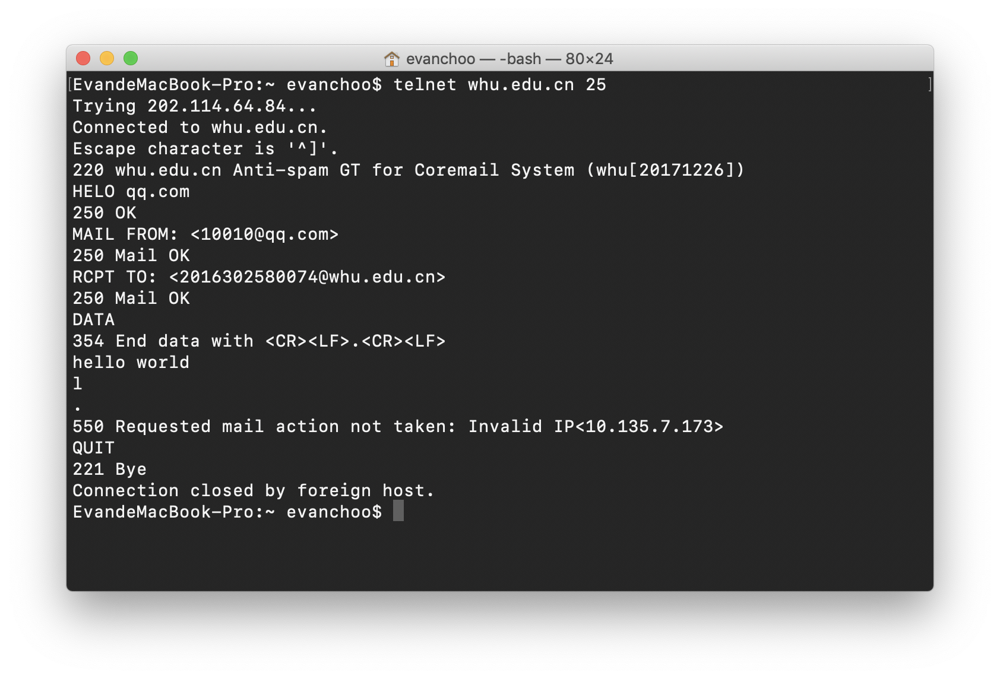

**telnet whu.edu.cn 25**



**P1.** True or false?

a. A user requests a Web page that consists of some text and three images. For this page, the client will send one request message and receive four response messages.
b. Two distinct Web pages (for example, www.mit.edu/research.html and www.mit.edu/students.html) can be sent over the same persistent connection.
c. With nonpersistent connections between browser and origin server, it is possible for a single TCP segment to carry two distinct HTTP request messages.
d. The Date: header in the HTTP response message indicates when the object in the response was last modified.
e. HTTP response messages never have an empty message body.

**Solution:**

a. **False**. When the client works in non-persistent mode, there will be 4 individual TCP connections and thus send 4 request messages and receive 4 response messages. When in persistent mode, there will be only 1 TCP connection but there are still 4 request messages and 4 response messages.

b. **True.** Multiple web pages residing on the same server can be sent from the server to the same client over a single TCP connecton.

c. **False.** When in non-persistent mode, TCP connection is close after the first message is received. And there will be a new connection to send the second HTTP request.

d. **False.** The Date: header indicates the date and time that server generates and send the response message. 

e. **False.** Some HTTP response messages will have empty message body. For example, when the statue-code of the response message is `204 No Content`, the response message body will be empty.

---

**P3.** Consider an HTTP client that wants to retrieve a Web document at a given URL. The IP address of the HTTP server is initially unknown. What transport and application-layer protocols besides HTTP are needed in this scenario?

**Solution:**

Transport protocol: UDP(for DNS), TCP(for HTTP)

Application protocol: DNS and HTTP

---

**P4.** Consider the following string of ASCII characters that were captured by Wireshark when the browser sent an HTTP GET message (i.e., this is the actual content of an HTTP GET message). The characters <cr> <lf> are carriage return and line-feed characters (that is, the italized character string <cr> in the text below represents the single carriage-return character that was contained at that point in the HTTP header). Answer the following questions, indicating where in the HTTP GET message below you find the answer.

```html
GET /cs453/index.html HTTP/1.1<cr><lf>Host: gaia.cs.umass.edu<cr><lf>User-Agent: Mozilla/5.O (Windows;U; Windows NT 5.1; en-US; rv:1.7.2) Gecko/20040804 Netscape/7.2 (ax) <cr><lf>Accept:ext/xml, application/xml, application/xhtml+xml, text/html;q=0.9, text/plain;q=0.8,image/png,*/*;q=0.5<cr><lf>Accept-Language: en-us,en;q=0.5<cr><lf>Accept-Encoding: zip,deflate<cr><lf>Accept-Charset: ISO-8859-1,utf-8;q=0.7,*;q=0.7<cr><lf>Keep-Alive: 300<cr><lf>Connection: keep-alive<cr><lf><cr><lf>
```

a. What is the URL of the document requested by the browser?
b. What version of HTTP is the browser running?
c. Does the browser request a non-persistent or a persistent connection?
d. What is the IP address of the host on which the browser is running?
e. What type of browser initiates this message? Why is the browser type
needed in an HTTP request message?

**Solution:**

a. From the requested file `/cs453/index.html` and the host of the page `gaia.cs.umass.edu`, we can infer that the URL of the document is `http://gaia.cs.umass.edu/cs453/index.html`

b. From `HTTP/1.1`, it can be known that the browser is running HTTP version 1.1.

c. From `Connection: keep-alive` we can know that the connection is persistent connection.

d. The HTTP request message didn't provided the information needed to infer the IP address of the client IP address.

e. `Mozilla/5.0` indicates that the browser is Mozilla 5.0. The browser type is needed for the reason that the server sends different versions of the same object according the the browser type to achieve best user experience.

---

**P7.** Suppose within your Web browser you click on a link to obtain a Web page. The IP address for the associated URL is not cached in your local host, so a DNS lookup is necessary to obtain the IP address. Suppose that n DNS servers are visited before your host receives the IP address from DNS; the successive visits incur an RTT of RTT1,...,RTTn. Further suppose that the Web page associated with the link contains exactly one object, consisting of a small amount of HTML text. Let RTT0 denote the RTT between the local host and the server containing the object. Assuming zero transmission time of the object, how much time elapses from when the client clicks on
the link until the client receives the object?

**Solution:**

Suppose the time taken for a DNS lookup is $T_{DNS}$ and the time for retrieving the object is $T_{retr}$.

As we know, $T_{DNS}=RRT_1+...+RRT_n$

And $RRT_0$ is first taken for the hand-shaking process to establish the TCP connection and another $RRT_0$ is cost to request and send the object.

Thus $T_{retr}=2*RRT_0$

So, the total time $T_{total}=T_{DNS}+T_{retr}=2*RRT_0+RRT_1+...+RRT_n$

---

**P17.** Consider accessing your e-mail with POP3.

a. Suppose you have configured your POP mail client to operate in the download-and -delete mode. Complete the following transaction:

```
C: list
S: 1 498
S: 2 912
S: .
C: retr 1
S: blah blah ...
S: .........blah
S: .
?
?
```

b. Suppose you have configured your POP mial client to operate in the download-and-keep mode. Complete the following transaction:

```
C: list
S: 1 498
S: 2 912
S: .
C: retr 1
S: blah blah ...
S: .........blah
S: .
?
?
```

c. Suppose you have configured your POP mail client to operate in the download-and-keep mode. Using your transcript in part(b), suppose you retrieve messages 1 and 2, exit POP and then five minutes later you again access POP to retrieve new email. Suppose that in the five-minute interval no new messages have been sent to you. Provide a transcript of this second POP session.

**Solution:**

a. Download-and-delete mode will delete the email after retrieved it. So the transaction is like the following:

```
C: dele 1
C: retr 2
S: blah balh ...
S: .........balh balh
S: .
C: dele 2
C: quit
S: +OK POP3 server signing off
```

b. Download-and-keep mode will not delete the email, thus the following transaction will appear:

```
C: retr 2
S: blah balh ...
S: .........balh balh
S: .
C: quit
S: +OK POP3 server signing off
```

c. Since no email is deleted, the server will still list all the emails after client send the LIST request:

```
C: list
S: 1 498
S: 2 912
S: .
C: retr 1
S: blah blah ...
S: .........blah
S: .
C: retr 2
S: blah balh ...
S: .........balh balh
S: .
C: quit
S: +OK POP3 server signing off
```


