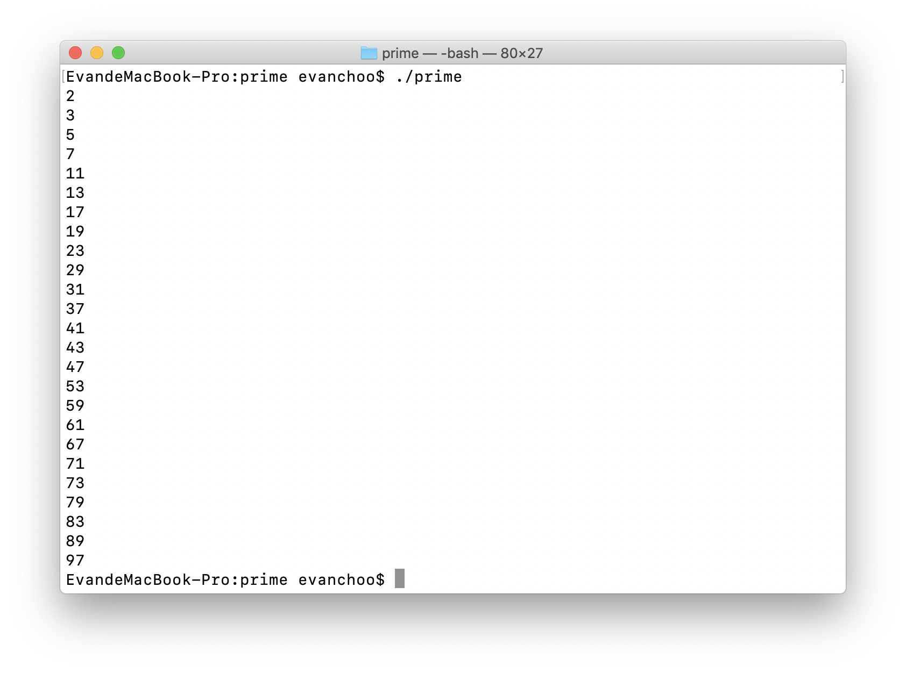
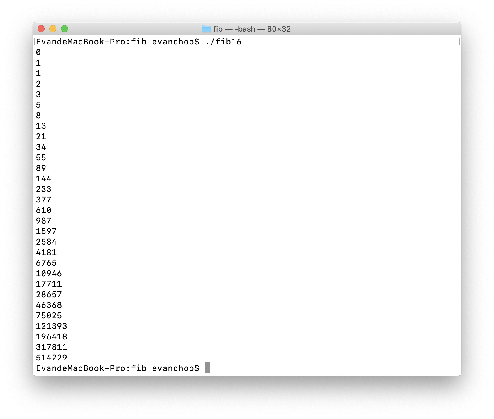
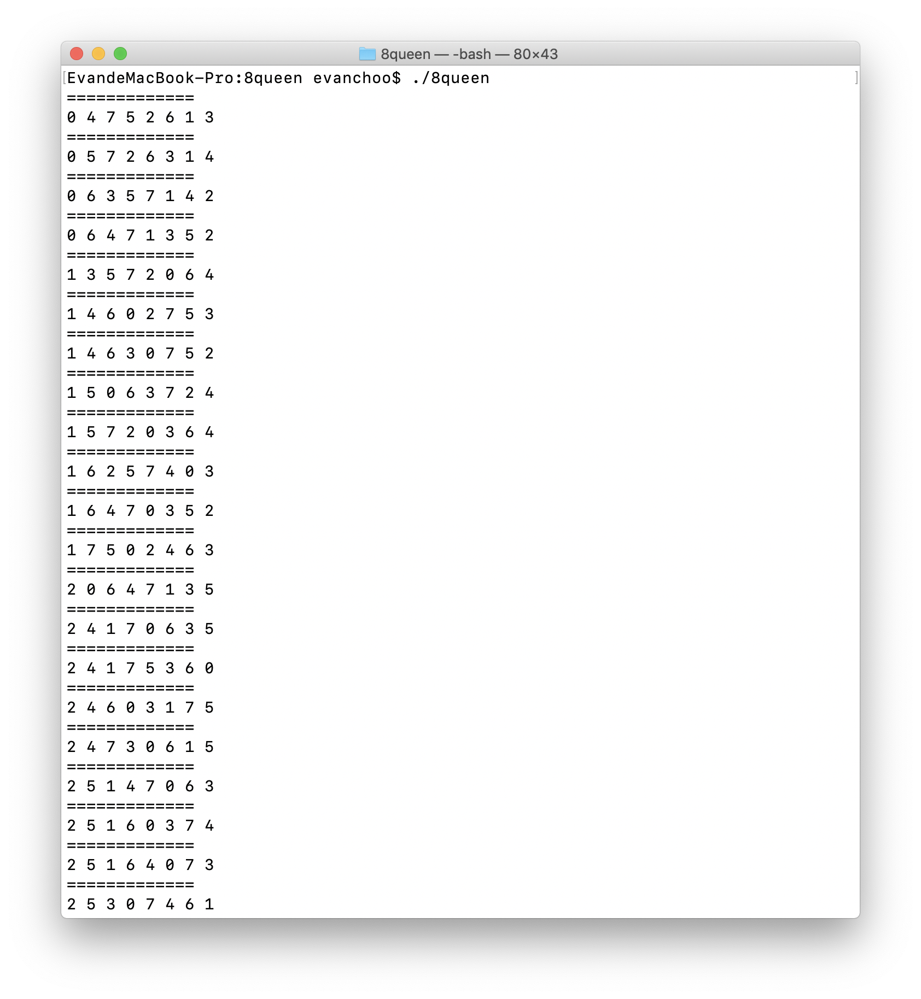
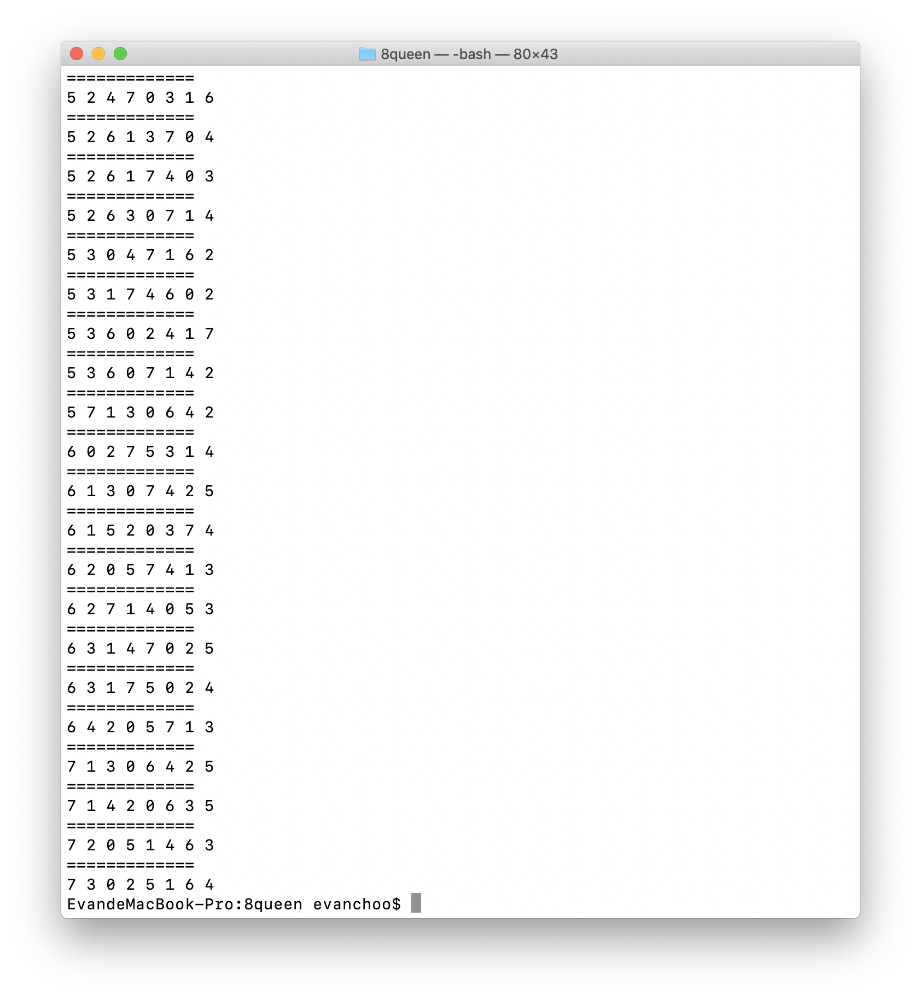

## 如何执行代码

- 首先使用Homebrew安装NASM

  ```shell
  $ brew install nasm
  ```

- 然后使用NASM编译汇编代码

  ```shell
  $ nasm -f macho64 your_file.asm && gcc your_file.o -o your_file
  ```

- 执行可执行文件

  ```shell
  $ ./your_file
  ```


## 题目

- 输出0-100的质数
- 输出前30个斐波那契数列中的数
- 输出八皇后问题的所有解

- 8位D/A转换器的端口地址为220H，延时20ms的子程序为DELAY_20MS，参考电压为+5V，输出信号到示波器显示，试编程如下图形：
  - 下限为0V，上限为+5V的三角波
  - 下限为1.2V，上限为4V的梯形波


## 前三题执行结果截图

- 

- 

- 在第三题的结果中，第i位的数字$D_i(i = 1, ..., 8)$表示在第i行的皇后所在的列数（列数从0开始，范围为0～7）。结果有点长，只截取了最开始的一部分和最后一部分结果。

  