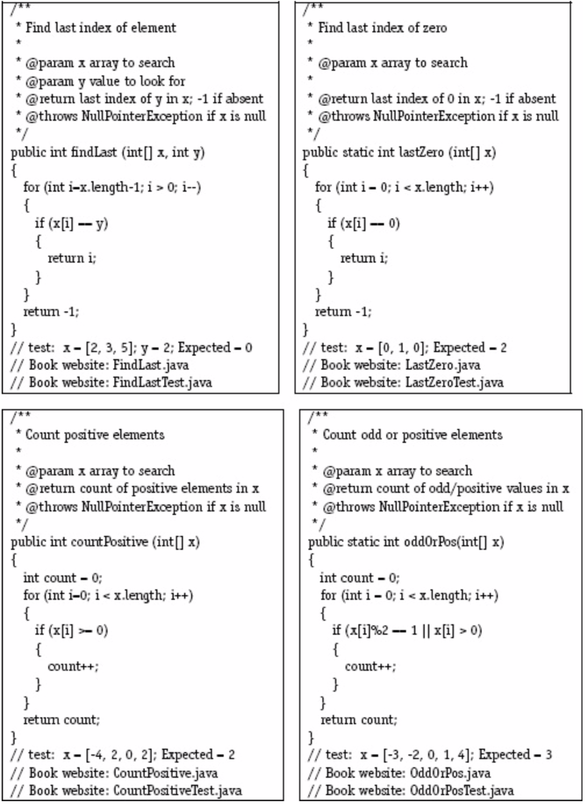
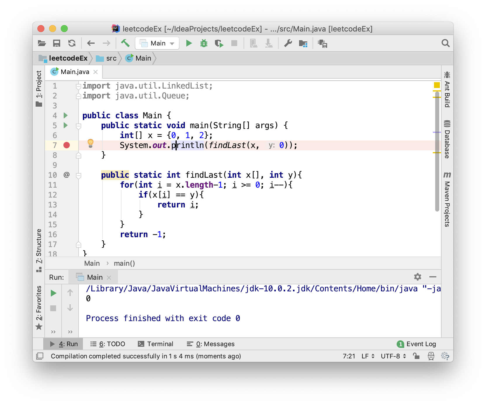
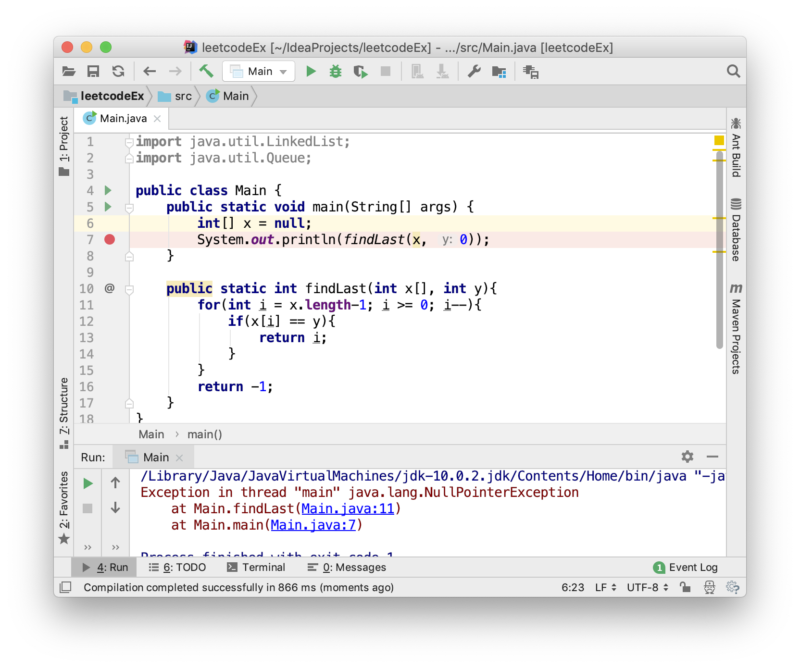
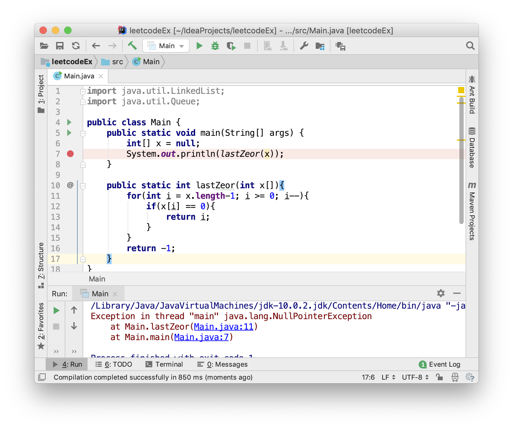
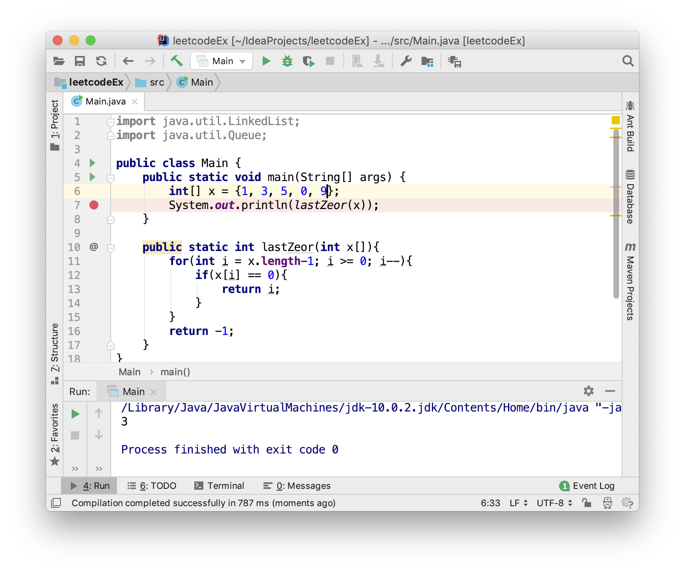
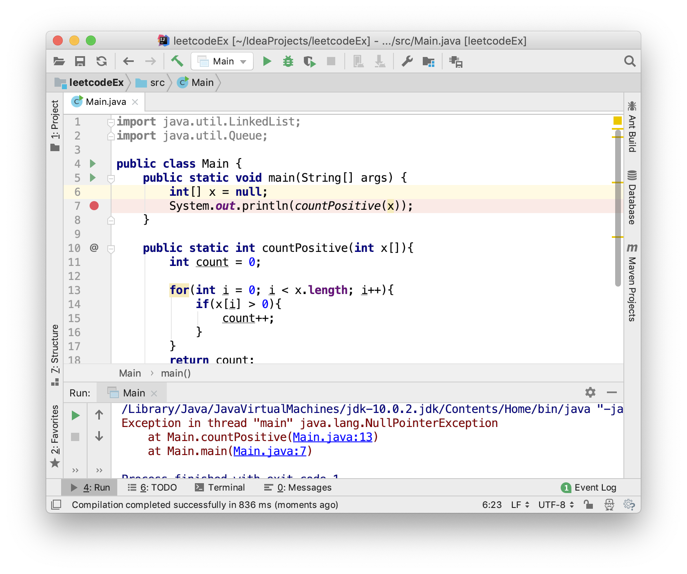
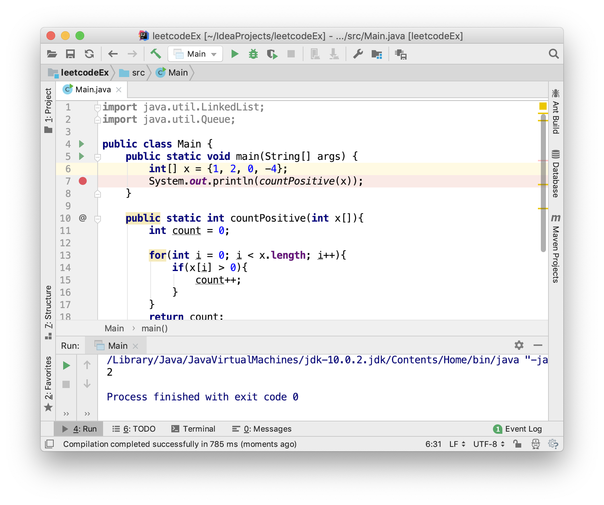
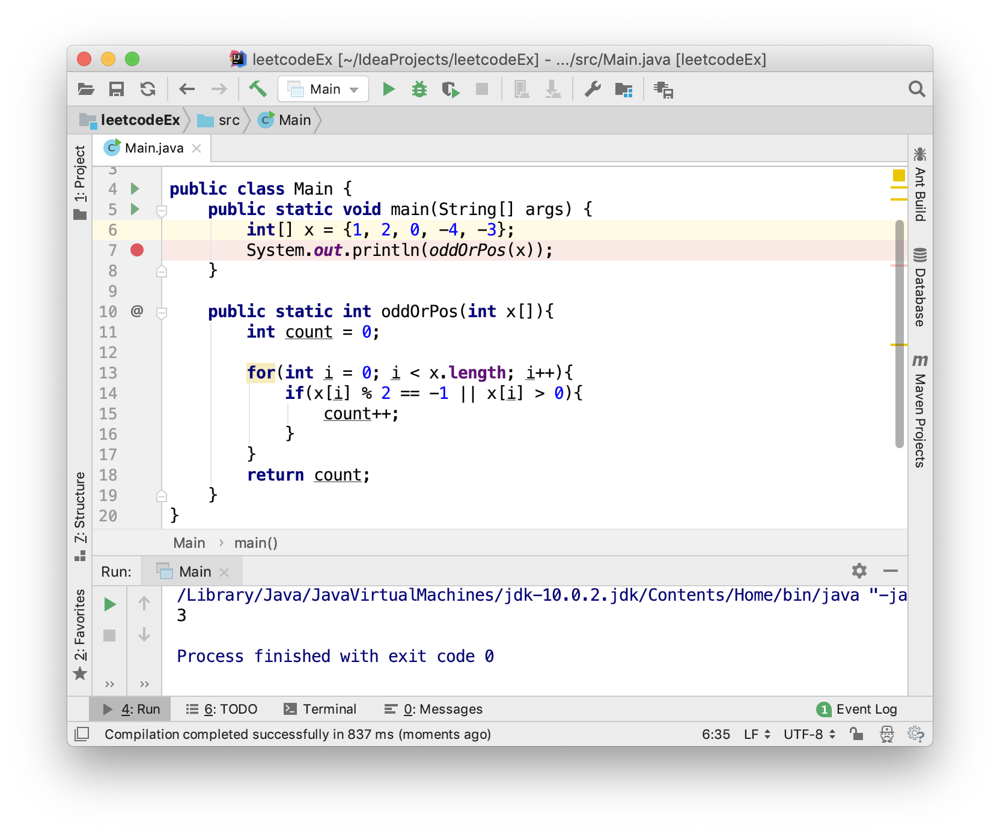
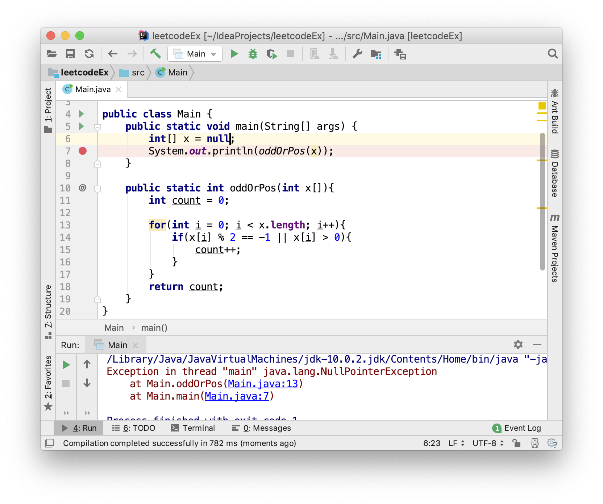

## Software Testing-HW1

### Chapter 1

**EX5.** Below are four faulty programs. Each includes test inputs that result in failure. Answer the following questions about each program.



1. Explain what is wrong with the given code. Describe the fault precisely by proposing a modification to the code.

2. If possible, give a test case that does **not** execute the fault. If not, briefly explian why not.
3. If possible, give a test case that executes the fault, but does **not** result in an error state. If not, briefly explain why not.
4. If possible give a test case that results in an error, but **not** a failure. If not, briefly explain why not. Hint: Don't forget about the program counter.
5. For the given test case, describe the first error state. Be sure to describe the complete state.
6. Implement your repair and verify that the given test now produces the expected output. Submit a screen printout or other evidence that your new program works.

**Solution**:

`findLast()`

1. When the element to be found is the first element, the function will always return -1. Modification is to turn the for loop into the following format:

   ```java
   for(int i = x.length() - 1; i >= 0; i-- )
   ```

2. When the test case is a nulll reference, the test case won't execute the fault `i > 0`. Since when `x.length` is executed, the program throws out the exception.

3. When fault is executed, `i > 0` is performed. Thus when the element to be found is not the first element, there is no error. Case like `x = [1, 2, 3]`, `y = 3`

4. Test case like `x = [1, 2, 3]`, `y = 3` won't result in an failure state.

5. The first error state is after i is initialized to x.length-1 and i > 0 is performed. This creates an error state.

6. 

   

`lastZero()`

1. The code's loop is executed from i = 0 instead of i = x.length - 1

   Modification:

   ```java
   for (int i = x.length - 1; i >= 0; i--)
   ```

2. Such test case does not exist. When x is null, the exception won't be thrown until i is initialized to 0, which executed the fault. And other cases also perform the fault.

3. When fault is executed, error state happens in the original code.

4. Test case `x = [0, 1, 2]` won't result in a failure state.

5. The first error happens when i is initialized to 0 where it should have been initialized to x.length-1.

6. 

   

`countPositive()`

1. 0 is not a positive number. The comparision `x[i] >= 0` should be modified as:

   ```java
   x[i] > 0
   ```

2. When x is null, the program terminates when `x.length` is performed. Thus the fault won't be executed.

3. When there is no 0 in the array, there won't be an error state. Case like `x = [1, 2, 3], y = 3`

4. Such test case exists. For example, `x = [1, 2, 3, 4]` and `y = 4`

5. The first error state happens when i = 0 and the statement `x[i] >= 0` is performed.

6. 

   

`oddOrPos()`

1. The code didn't take negative number into account. Modification:

   ```java
   if (x[i] % 2 == -1 || x[i] > 0)
   ```

2. When x is null, fault won't be executed.

3. Case like `x = [1, 2, 3], y = 3`

4. All error will result in failure. Since when a negative odd number is in the array, there is an error state, and the subsequent failure will happen.

5. The first error happens when x[i] refers to a negative odd number.

6. 

   

### Chapter 3

**EX5.** The following JUnit test method for the `sort ()` method has a non-syntactic flaw. Find the flaw and describe it in terms of the RIPR model. Be as precise, specific, and concise as you can. For full credit, you must use the terminology introduced in the book. In the test method, names is an instance of an object that stores strings and has methods `add()`, `sort ()`, and `getFirst ()`, which do exactly what you would expect from their names. You can assume that the object names has been properly instantiated and the `add ()` and `sort ()` methods have already been tested and work correctly.

```java
@Test
public void testSort()
{
    names.add ("Laura");
    names.add ("Han");
    names.add ("Alex"); .
    names.add ("Ashley");
    names.sort();
    assertTrue ("Sort method", names.getFirst().equals ("Alex"));
}
```

**Solution**:

Only the first element has the assertion checked. If a test cause a fault and propagates to another part of the final state, the failure won't be revealed.  


**EX6.** Consider the following example class. PrimeNumbers has three methods. The first, `computePrimes()` , takes one integer input and computes that many prime numbers. `iterator ()` returns an Iterator that will iterate through the primes, and `toString ()` returns a string representation.

```java
public class PrimeNumbers implements Iterable<Integer>
{
	private List<Integer> primes = new ArrayList<Integer>();
	
	public void computePrimes (int n)
	{
        int count= 1; // count of primes
        int number= 2; // number tested for primeness
        boolean isPrime; // is thỉs number a prime
        while (count <= n)
        {
            isPrime = true;
            for (int divisor = 2; divisor <= number / 2; divisor++)
            {
            	if (number % divisor == 0)
            	{
                    isPrime = false;
                    break; // for loop
            	}
            }
            if (isPrime && (number % 10 != 9)) // FAULT
            {
                primes.add (number);
                count++;
            }
            number++;
        }
	}

    @Override public Iterator<Integer> iterator()
    {
    	return primes.iterator();
    }
    
    @Override public String toString()
    {
    	return primes.toString();
    }
}
```

`computePrimes ()` has a fault that causes it not to include prime numbers whose last digit is 9 (for example, it omits 19, 29, 59, 79, 89, 109, . ..). If possible, describe five tests. You can describe the tests as sequences of calls to the above methods, or briefly describe them in words. Note that the last two tests require the test oracle to be described.

(a) A test that does not reach the fault

(b) A test that reaches the fault, but does not infect
(c) A test that infects the state, but does not propagate
(d) A test that propagates, but does not reveal
(e) A test that reveals the fault
If a test cannot be created, explain why.

**Solution**:

1. When n = 0, the fault can't be reached.
2. When the n is small enough to not include a prime number that ends with 9 digit. For example, n = 2.
3. No such test case exist. Whenever the state is infected, there will be a prime number that is not counted, and results in a failure.
4. No such test case exist. Whenever the error is propagated, is means an loss in the count of prime numbers.
5. When n is big enough to include a prime number that ends with digit 9. For example, n = 100.

