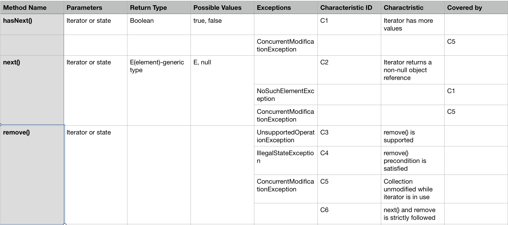
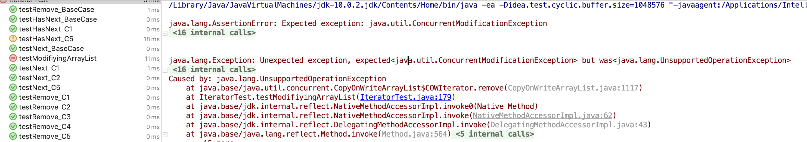

## Software Testing-HW3

**P1.** The restriction on interleaving `next()` and `remove()` calls is quite complex. The JUnit tests in `IteratorTest.java` only devote one test for this situation, which may not be enough. Refine the input domain model with one or more additional charactrisctics to probe this behavior, and implement these tests in JUnit.

**Solution:**

An additional charactristics is added to the input domain model, which is used to describe whether the correspoding `next()` and `remove()` is strictly followed with each other and we call it C6.



And then we got the following table:

|      | hasNext() | next() | remove() | Partition     | Base Case |
| ---- | --------- | ------ | -------- | ------------- | --------- |
| C1   | x         | x      | x        | {true, false} | true      |
| C2   |           | x      | x        | {true, false} | true      |
| C3   |           |        | x        | {true, false} | true      |
| C4   |           |        | x        | {true, false} | true      |
| C5   | x         | x      | x        | {true, false} | true      |
| C6   |           |        | x        | {true, false} | True      |

Thus, we can derive the refined test requirements like below:

| Method    | Characteristics | Test Requirements                                        | Infeasible Test Requirements | Revised Test Requirements | \# of Test Requirem |
| --------- | --------------- | -------------------------------------------------------- | ---------------------------- | ------------------------- | ------------------- |
| hasNext() | C1 C5           | {TT, FT, TF}                                             | all feasible                 | N/a                       | 3                   |
| next()    | C1 C2 C5        | {TTT, FTT, TFT, TTF}                                     | FTT, TTF                     | FTT->FFT, TTF->TFF        | 4                   |
| remove()  | C1-C6           | {TTTTTT, FTTTTT, TFTTTT, TTFTTT, TTTFTT, TTTTFT, TTTTTF} | FTTTTT                       | FTTTTT->FFTTTT            | 7                   |

The modified [JUnit test file](file://./IteratorTest.java) only added the following method `testRemove_C6()`

```java
// Test 7 of next(): testRemove_C6(): C1-T, C2-T, C3-T, C4-T, C5-T, C6-F
@Test (expected = IllegalStateException.class)
public void testRemove_C6()
{
    itr.next();
    itr.next();
    itr.remove();
    itr.remove();
}
```


**P2.** It is possible to modify an ArrayList without using the `remove()` method and yet have a subsequent call to `remove()` fail to throw `ConcurrentModificationException`. Develop a (failing!) JUnit test that exhibits this behavior.

**Solution:**

We use the `CopyOnWriteArrayList` to demostrate this example. As we know, when we are using the `ArralyList Iterator`, we can only remove a element using the `iterator`'s `remove()` method. Any call on the methods of the underlying ArrayList will raise `ConcurretModificationException`. 

`CopyOnWriteArralyList` is a multi-thread safe ArrayList suitable for multi-thread programs. It won't raise `ConcurretModificationException` but using the `remove()` of its iterator will raise `UnsupportedOperationException`.

Thus, we satisfied the conditions listed in the text: 

1. we use the method `remove()` of `CopyOnWriteArralyList` to modify the arraylist
2. subsequent call to `remove()` doesn't throw `ConcurretModificationException`, instead it throws `UnsupportedOperationException`

Here is the JUnit test code (**failing!**):

```java
	@Test (expected = ConcurrentModificationException.class)
    public void testModifiyingArrayList()
    {
        list = new CopyOnWriteArrayList<String>();
        list.add("zero");
        list.add("one");
        list.add("two");

        itr = list.iterator();
        itr.next();
        list.remove(0);
        itr.remove();
    }
```

